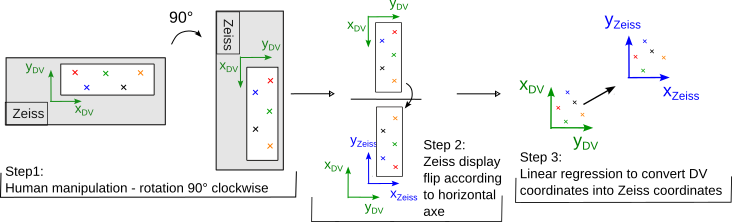

# Live Cell Phenotyping Capture Procedure 

**Authors :** Asma Chalabi, Marielle Péré. Code developed in the [**Roux lab**](https://github.com/jrxlab), presented in the protocol for fate-seq (Bian *et al.*, STAR Protocols 2022).  

**Note :** This code has been developed under Python >= 3.8 .


## Plot_AllTraj_FrameSlide_Cell_Field_Label.py

The following script take as an input .csv files of FRET trajectories. Where each file corresponds to a field and contains a matrix of single-cell FRET trajectories organized into (frames, cells). The field number is indicated by the file name ( field#.csv ).

This code creates a single label for each cell in the experiment, it ranks the cells depending on the mean time derivative values. This ranking allows to select cells of interest : the 7 Top High Responders and the 7 Bottom Low Responders that would be microdissected for downstream analysis and that can be identified on the images by  their unique labels.

### Code structure

#### Requirement

- Numpy.
- Scipy.
- Pandas.
- Glob.
- Matplotlib.

#### Global variables

*DIR_PATH* : Path to the .csv files directory.

*TIME_UNIT* : The time unit to use. It can be frames, minutes or hours.

*TBF* : Time Between Frames. It's the time between two following acquisitions.

*SLD_WIND* : The size of the sliding window for Savitzky-Golay filter.

#### Functions


**Traj_Proc** : The main function to run the code. It calls all the functions to run the script.

```
def Traj_Proc():
    
    print("\nRead Files ...\n")
    experiment, time_vec, labels = Read_csv_files ()
    
    print("\nProcess Trajectories ...\n")
    experiment = Process_trajectories (experiment)
    
    print("Compute Mean Time Derivative ...\n")
    mean_derivative = Compute_FRET_Derivative (experiment["process. Frame slide"])
    
    print("Sort Cells ...\n")
    sorted_mean_deriv,sorted_labels = SortandSave_FRET_deriv (mean_derivative, labels)
    
    print ("Plot FRET Trajectories ...\n")
    Plot_Top_Bottom_cells (experiment["process. Frame slide"],time_vec, labels,sorted_labels)
    
    print("Done")
    
    return experiment, time_vec,labels, mean_derivative
   ``` 


**Read_csv_files** : Reads and organizes the .csv files. It merges all the fields in the same matrix to remodel the whole frame slide.

**Get_cell_labels** : This function create a unique label for each cell based on the field number and the cell number in the field : ***field#.cell#***  .

**Process_trajectories** : This function precesses the FRET trajectories. Each trajectory is smoothed with S-Golay filter than normalized by subtracting the first FRET value. The normalization makes all the trajectories start from 0 and allows to compare them.

**Compute_FRET_derivative** : Computes the FRET trajectories mean time derivative on the last 4th frames. The mean time derivative is an indicator of the cell activity.

**SortandSave_FRET_deriv** : This function ranks the cells depending on their mean FRET time derivative. It selects the 7 Top High Responders and the 7 Bottom Low Responders and save the result of the all sorted cells and the selected cells on .xlsx files with their mean time derivative values and the label corresponding to each cell.

**Plot_Top_Bottom_cells** : This function plots all the FRET trajectories highlighting the cells of interest : the 7 Top Highest Responders in red and the 7 Bottom Low  Responders in green in addition to their corresponding labels ***field#.cell#.rank*** . This plot allows to check the activity of the selected cells.

### Input

The code requiers a directory containing the .csv files as an input.
The path to this directory is to indicate in *DIR_PATH* global variable.
The .csv file name must be : ***field#.csv*** .

### Output

**dFRET.xlsx** : Excel file containing the single-cell mean FRET time derivative ranked from the highest responders to the lowest responder and their correspnding labels (***field#.cell#***).

**dFRET_selected_cells.xlsx** : Excel file with the 7 Top High Responders and the 7 Bottom Low Responders with their corresponding labels (***field#.cell#***).

**FRET.pdf** : Plot of all the FRET trajectories highlighting the 7 Top High Responders in red and the 7 Bottom Low Responders in green and their corresponding labels (***field#.cell#.rank***).


## DVtoZeiss.py

## Coordinates conversion DV to Zeiss  

### From STAR-Protocols: 

  

"Point list coordinates can be incompatible between DeltaVision and Zeiss systems. A conversion of the point lists must be performed to locate the field of interest. To perform the conversion, coordinates must be obtained from both microscopes using the same FrameSlide marked with 4 points. (The points can be simply drawn with a fine marker.) The FrameSlide is mounted on each microscope as described above (with a clockwise 90° rotation between the DeltaVision and the Zeiss (see step 1 on the figure below)). The coordinates from both microscopes are recorded on a point list as described. The Zeiss microscope will flip the coordinates for display, according to a horizontal axe (step 2). The point list will be used to determine the coefficients of a linear regression for both x and y coordinates of each point, that can then be applied to convert any point list from the DV to the PALM Zeiss setup. With the manual rotation of the FrameSlide and the Zeiss display flip, the y<sub>Zeiss</sub> only depends on the x<sub>DV</sub> , and the x<sub>Zeiss</sub> only depends on y<sub>DV</sub> (step3). A second round of this procedure can be repeated using cells instead of marker points in order to increase the accuracy of the conversion. " 

  



  

## In details: 

What we do here if called a change of reference frame.   

  

### 1: Manual rotation: Rotate the Frame Slide   

  

As you rotate the slide frame to 90° clockwise, we have:   

  


  

### 2: Zeiss display   

  

Zeiss display will flip the frame slide according to a horizontal axe like shown in the figure.  

  


  

###  3: Compute the mathematical relationship between DV coordinates and Zeiss coordinates  

  

The reference frames, and especially their origins, are not the same in the DV and the Zeiss.  To find the mathematical relationship between the DV coordinates (x<sub>DV</sub>, y<sub>DV</sub>) and the Zeiss coordinates (x<sub>Zeiss</sub>, y<sub>Zeiss</sub>), as it is just a shift: 

  


  

we have chosen a linear relationship so:  

  

y<sub>Zeiss</sub>= a . x<sub>DV</sub> + b,  

  

x<sub>Zeiss</sub>=c . y <sub>DV</sub> + d.  

  

                                                                         

  

To find a,b ,c , d, we need at least 2 reference points, P<sup>1</sup>and P<sup>2</sup>, drawn with a marker on the frame slide for which we have the two couple of coordinates on the DV: (P<sup>1</sup><sub>DV</sub>=(x<sup>1</sup><sub>DV</sub>, y<sup>1</sup><sub>DV</sub>) and P<sup>2</sup><sub>DV</sub>=(x<sup>2</sup><sub>DV</sub>, y<sup>2</sup><sub>DV</sub>)) and the corresponding coordinates on the Zeiss: (P<sup>1</sup><sub>Zeiss</sub>=(x<sup>1</sup><sub>Zeiss</sub>, y<sup>1</sup><sub>Zeiss</sub>), and (P<sup>2</sup><sub>Zeiss</sub>=(x<sup>2</sup><sub>Zeiss</sub>, y<sup>2</sup><sub>Zeiss</sub>)).  

  

Then we solve the system with the function solve from the python package scipy.linalg:   

  

y<sup>1</sup><sub>Zeiss</sub>= a . x<sup>1</sup><sub>DV</sub> + b,

  

x<sup>1</sup><sub>Zeiss</sub> =c . y<sup>1</sup><sub>DV</sub> + d,  

  

y<sup>2</sup><sub>Zeiss</sub> = a . x<sup>2</sup><sub>DV</sub> + b,  

  

x<sup>2</sup><sub>Zeiss</sub> =c . y2<sup>2</sup><sub>DV</sub> + d,  

  

  

  

To increase the accuracy of the conversion, the more marker points on the Frame Slide, the better. But as soon as we have more values than unknown variables, the system becomes over-determined. To overcome this issue, instead of using solve to find a,b,c and d, we use a least-square method (lstsq of the scipy.linalg package) to find the best linear relation between all the x<sup>i</sup><sub>DV</sub> and the y<sup>i</sup><sub>Zeiss</sub>, and all the y<sup>i</sup><sub>DV</sub> and the x<sup>i</sup><sub>Zeiss</sub> , $1 \leq i \leq 5$  in the example:   

  


## DVtoZeiss.py explanation: 

  
Each function has a help documentation.  See DVtoZeiss main for the examples.


**Note 1 :** If you know the conversion matrix and conversion vector of your two microscopes, please put them as input to the function allConversion.

  

**Note 2 :** If no marker points coordinates (Zeiss_Init and DV_init)  and no conversion matrix (A) and vector (B) are given in allConversion, the function will use Zeiss_Init=ZEISS_ARRAY, DV_init=DV_ARRAY to compute the conversion matrix and vector.  
  
### Input:

  **path_to_dv_pts_file** : str, define path toward the .pts file with the 20 fields coordinates on the DeltaVision.
  
  **name_dv_pts_file** : str,  name of .pts file with the 20 fields coordinates on the DeltaVision.
  
**path_saved_zeiss_file** : str, define path toward the folder where to save the output .csv file with the 20 fields coordinates in the DeltaVision and their converted coordinates in Zeiss.

**name_saved_zeiss_file** : str, define name of the .csv file with the 20 fields coordinates in the DeltaVision and their converted coordinates in Zeiss.

**Optionnal** (see note 1 and 2):

**DV_init** : numpy array,  DV maker points coordinates.

**Zeiss_init** :  numpy array,  Zeiss corresponding maker points coordinates.

### Output:  

**Saved**: 

1 - **name_saved_zeiss_file.csv** : CSV file with 4 columns and p rows (one per field in the Frame Slide, here 20) saved.   

**Return by the function**:
  
1 - **combined_coordinates_system_pts_dataframe** : pandas dataframe with 4 columns (x_DV, y_DV, x_Zeiss, y_Zeiss) and p rows (one per field in the Frame Slide, here 20).

2 - **A** : numpy array 2 x 2, Conversion matrix A.  

  

3 - **B** : numpy array 2 x 1, Conversion vector B such that: 

 $x_{Zeiss} = a.y_{DV}  + b,$

$y_{Zeiss} = c.x_{DV}+ d,$

$\iff X_{Zeiss}=A.X_{DV} +B,$
with 
  


### Execution:  

How to use DVtoZeiss.py  


If you have only the file with DV coordinates for the 20 fields, the function will used our marker point coordinates to compute the conversion :

```py
>>> import DVtoZeiss

>>> DVtoZeiss.allConversion( path_to_dv_pts_file, name_dv_pts_file, path_saved_zeiss_file, name_saved_zeiss_file)  
```

If you have the file with DV coordinates for the 20 fields + a numpy array with the DV coordinates of the maker points (DV_init) and the numpy array of the corresponding coordinates in the Zeiss (Zeiss_init)  :

```py
>>> import DVtoZeiss 

>>> DVtoZeiss.allConversion( Zeiss_init, DV_init, path_to_dv_pts_file, name_dv_pts_file, path_saved_zeiss_file, name_saved_zeiss_file)  
```

If you have the file with DV coordinates for the 20 fields + the conversion matrix A and the conversion vector B :

  ```py
>>> import DVtoZeiss 

>>> DVtoZeiss.allConversion( A,B,path_to_dv_pts_file, name_dv_pts_file, path_saved_zeiss_file, name_saved_zeiss_file)  
```
  

### Code structure:  

  

----------------**Requierements / import**--------  

- Numpy.
- Scipy.
- Pandas.
- Matplotlib.

----------------**Global Variable**---------------  

*DV_ARRAY* : numpy array, define the markers point coordinates in the DeltaVision.

*ZEISS_ARRAY* : numpy array, define the markers point corresponding coordinates in the Zeiss.

*PATH_TO_DV_PTS_FILE* : str, define path toward the .pts file with the 20 fields coordinates on the DeltaVision.

*NAME_DV_PTS_FILE* : str,  name of .pts file with the 20 fields coordinates on the DeltaVision.

*PATH_SAVED_ZEISS_FILE* : str, define path toward the folder where to save the output .csv file with the 20 fields coordinates in the DeltaVision and their converted coordinates in Zeiss.

*NAME_SAVED_ZEISS_FILE* : str, define name of the .csv file with the 20 fields coordinates in the DeltaVision and their converted coordinates in Zeiss.
  
  

  

----------------**Functions**----------------------  

  

**See function help for more information.** 


**computeLinearCoefficientDVtoZeiss** : Compute the linear coefficients of the linear regression to translate the coordinates used in DeltaVision into the corresponding coordinates on the Zeiss.

**computeZeissCoordinatesFromDVcoordinates** : Compute the linear coefficients of the linear regression to translate the coordinates used in DeltaVision into the corresponding coordinates on the Zeiss by using DV_init (numpy array with the DV coordinates of the marker points) and Zeiss_Init (numpy array with the Zeiss corresponding coordinates of the marker points)
    or, if the conversion matrix  A and the conversion vector B are defined, use A and B  
    to compute the translation for the DV point in DV.
    
 **openDVptsFile** : takes as input the path to the DV .pts and returns a dataframe of the DV x,y,z coordinates.
  
**plotFrameSlide** : plot the Frame slide in 2D with all the point in coordinate_array on ax subplot if defined, if not create the figure.

**plotCoordinatesConversion** : plot the Frame slide in 2D with all the point in the DV and in the Zeiss in a 2-subplots figures.

**allConversion** : Compute the conversion matrix A and the conversion vector B to convert the DV coordinates into the Zeiss corresponding coordinates by using the markers points coordinates arrays. Return a panda dataframe with the DV coordinates from the .pts file of the 20 fields of the FrameSlide and the corresponding coordinates in the Zeiss, save this dataframe into a .csv and return also A and B.

 
----------------**Main/ Function tests**--------  

  

**Test conversion** :  

Compute convertion matrix and then apply the convertion  on the DV points obtained with the marker on the FrameSlide.   

  

**All conversion steps** :

<ol> 

<li>Load .pts file with the 20 fields coordinates in the DeltaVision  with openDVptsFile. </li> 

  

<li>Turn the panda dataframe into a numpy array and keep only the x and y coordinates. </li> 

  

<li>Compute conversion matrix and conversion vector thanks to DV_ARRAY and ZEISS_ARRAY with computeZeissCoordinatesFromDVcoordinates. </li> 

  

<li>Create panda dataframes for the 20 fiels coordinates in the DeltaVision and in the Zeiss. </li> 

  

<li>Combine the DeltaVision and Zeiss dataframes to create the first output. </li> 

  

<li>Save the first output into .csv. </li> 

  

<li>Plot the conversion between DeltaVision and Zeiss with plotCoordinatesConversion. </li></ol> 

  

**Complete pipeline inside one function**  : 

  

combined_coordinates_system_pts_dataframe,A,B=allConversion()  

  

Combined_coordinates_system_pts_dataframe is the output dataframe that will be saved into a .csv file, A the conversion matrix and B the conversion vector.  

  


